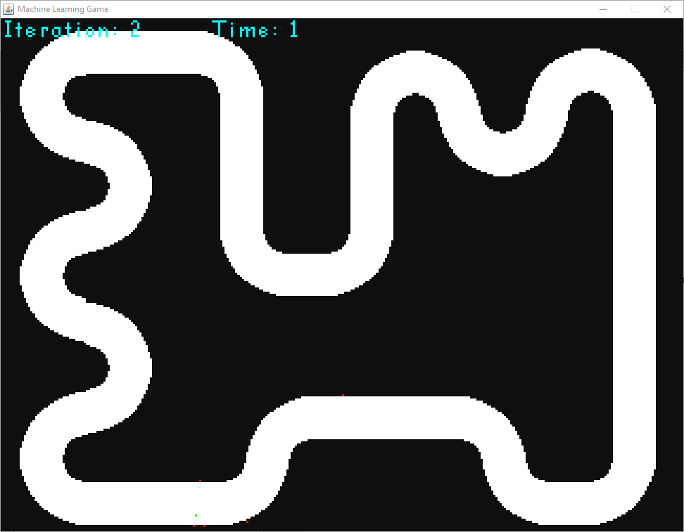
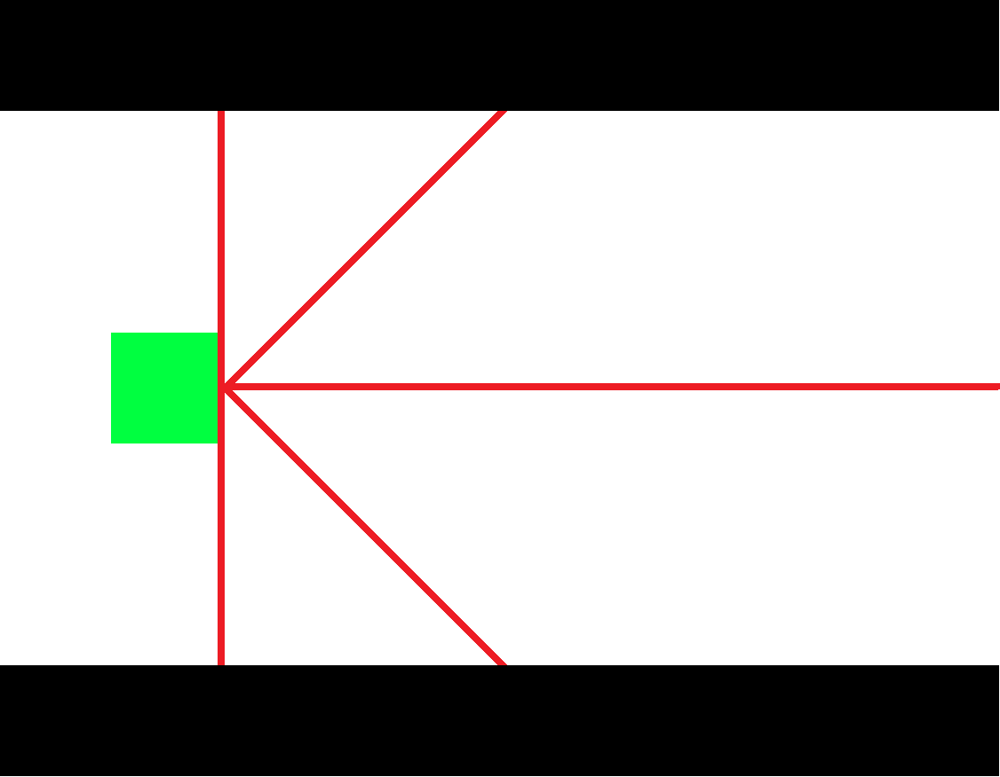
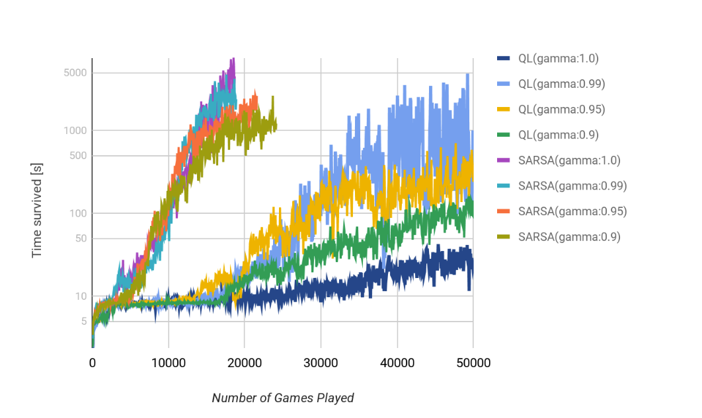

# Machine Learning Game

Project includes implementation of simple game and reinforcement learning agent that plays it.
Having some constant velocity, agent is intended to stay within the provided road, having control only over the direction (like in the case of a car wheel).

<br/>

Agent has informations about distances from the wall from five sensors (measuring distance at 0, +-45 and +-90 degree).

<br/>

## Installation and Startup

### 1. IntelliJ Project

Download the project. Install dependencies with Maven. Run the "startup\Run.java" file. GameManager arguments can be modified to test with different map/learning parameters.

### 2. MLG.jar

I included already compiled MLG.jar file. To run it, open console in the folder that contains it and run one of the given configurations:

```
java -jar MLG.jar <PARAMETERS>
```

Possible configurations of parameters:
  
learnerType alpha gamma  
mapPath agentX agentY learnerType modelPath  
mapPath agentX agentY learnerType alpha gamma  
mapPath agentX agentY learnerType alpha gamma colData avg itsd  

Description in 'Customization' section.

For example: 
```
java -jar MLG.jar /map02.png 40 220 SARSA 0.1 0.99

```

When game is run it is possible to speed up the process by disabling graphics rendering.  
There are 3 Keyboard inputs to control it.

Press:

I - Disables rendering for 500 iterations
O - Disable rendering
P - Enable rendering

## Customization

There are X arguments that can be modified.

mapPath - Path to the map file  
agentX - Starting X coordinate of an agent  
agentY - Starting Y coordinate of an agent  
learnerType - Type of a learner (currently only SARSA and QLearn are implemented)  
modelPath - Path to previously saved model  
alpha - Learning rate of an agent <0, 1>  
gamma - Parameter defining impact of future rewards on current decision <0, 1>  
colData - Boolean defining whether to collect data or not (disabled by default)  
avg  - Number of iterations to be taken an average from and displayed in console  
itsd - presents the number of iterations after which data is appended to the data file  


## Results 

Example of results from one of the experiments carried out on my computer on map4.png for alpha equal to 0.01 and different values of gamma.
<br/>
